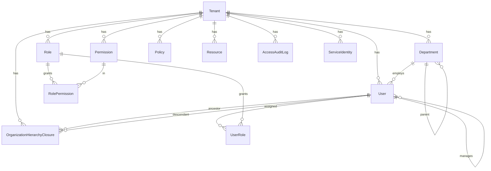
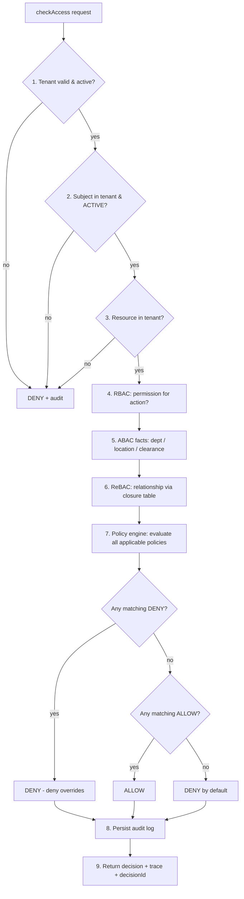

# Enterprise IAM — Access Control Service

A centralized, multi‑tenant **Identity & Access Management (IAM)** service for a SaaS platform. Every other microservice (User Management, Expense, Payroll, Invoice, Reporting, Workflow, Notification) delegates its authorization decisions to this service through a single `checkAccess` API.

This is **not a CRUD app**. Its core is a **hybrid authorization engine** combining:

- **RBAC** — Role‑Based Access Control
- **ABAC** — Attribute‑Based Access Control (department, location, clearance, sensitivity, employment status)
- **ReBAC** — Relationship‑Based Access Control over an org hierarchy stored in a **closure table** (no recursive manager traversal)
- **Policy Engine** — configurable, database‑stored policies with **deny‑override** combining semantics (AWS IAM / Azure RBAC style)

…all under strict **tenant isolation** with full **audit logging** and **observability**.

> 📐 **System design write-up:** [`DESIGN.md`](./DESIGN.md) covers the assignment's design brief end-to-end (FRs/NFRs, architecture, auth flow, isolation strategy, access model, service-to-service security, APIs/data models, scalability & reliability, security & compliance, operations, and an honest production‑readiness gap analysis). This README is the build/run guide.

---

## Table of Contents

1. [Tech Stack](#tech-stack)
2. [Architecture](#architecture)
3. [Folder Structure](#folder-structure)
4. [Data Model / ER Diagram](#data-model--er-diagram)
5. [Organization Hierarchy (Closure Table)](#organization-hierarchy-closure-table)
6. [Authorization Model & Flow](#authorization-model--flow)
7. [Policy Engine](#policy-engine)
8. [Multi‑Tenancy & Security](#multi-tenancy--security)
9. [How to Run](#how-to-run)
10. [How to Seed](#how-to-seed)
11. [GraphQL API & Examples](#graphql-api--examples)
12. [Acceptance Scenarios](#acceptance-scenarios)
13. [Testing](#testing)
14. [Observability](#observability)
15. [Future Improvements](#future-improvements)

---

## Tech Stack

| Concern | Choice |
| --- | --- |
| Runtime / Framework | Node.js 20, **NestJS 10**, TypeScript |
| API | **GraphQL (code‑first)** via Apollo Server |
| Persistence | **PostgreSQL 16** + **Prisma ORM** |
| Auth | JWT (`@nestjs/jwt`), bcrypt password hashing |
| Validation | `class-validator` / `class-transformer` |
| Logging | **Pino** structured JSON (`nestjs-pino`) |
| Packaging | **Docker** + **Docker Compose** (single command) |
| Tests | **Jest** (unit + e2e against a real DB) |

No external database is required — everything runs via `docker compose up --build`.

---

## Architecture

```
                         ┌──────────────────────────────────────────────┐
   Other microservices   │            IAM Access Control Service         │
  (Expense, Payroll, …)  │                                              │
            │  checkAccess│  ┌───────────────── Cross‑cutting ─────────┐ │
            └────────────▶│  │ CorrelationId → JwtAuthGuard →          │ │
                          │  │ Tenant/Role/Permission Guards →         │ │
                          │  │ ValidationPipe → LoggingInterceptor →   │ │
                          │  │ GlobalExceptionFilter                   │ │
                          │  └─────────────────────────────────────────┘ │
                          │        │                                     │
                          │        ▼                                     │
                          │   GraphQL Resolver ── Service ── Repository ─┼─▶ PostgreSQL
                          │        │                       (tenant‑scoped)│   (Prisma)
                          │        ▼                                     │
                          │   ┌──────────── AuthorizationService ──────┐ │
                          │   │ 1 Tenant  2 Subject  3 Resource        │ │
                          │   │ 4 RBAC    5 ABAC     6 ReBAC (closure)  │ │
                          │   │ 7 Policy engine (deny‑override)         │ │
                          │   │ 8 Audit log   9 Decision + trace        │ │
                          │   └─────────────────────────────────────────┘ │
                          └──────────────────────────────────────────────┘
```

**Design principles:** SOLID, Repository pattern, Dependency Injection, thin resolvers → services → repositories, entity↔GraphQL **mappers** (persistence never leaks to the API), DTO validation, and composable **evaluators** behind a common interface (open/closed — add a new signal without touching the engine).

---

## Folder Structure

```
.
├── docker-compose.yml          # postgres + api, healthchecks, depends_on
├── Dockerfile                  # multi‑stage: deps → build → slim runtime
├── docker-entrypoint.sh        # migrate deploy → seed → start
├── prisma/
│   ├── schema.prisma           # all entities + closure table
│   ├── migrations/             # SQL migrations (applied via `migrate deploy`)
│   └── seed.ts                 # Tenant A + Tenant B realistic data
├── src/
│   ├── main.ts                 # bootstrap: Pino, global pipe/filter/interceptor
│   ├── app/                    # root module, GraphQL wiring, health
│   ├── common/                 # logger, middleware, decorators, guards,
│   │                           # interceptors, filters, enums, base repository
│   ├── prisma/                 # PrismaService (global)
│   ├── auth/                   # login mutation, JWT, AuthContext
│   ├── tenants/  departments/  users/
│   ├── hierarchy/              # closure‑table service (ReBAC source of truth)
│   ├── roles/  permissions/    # RBAC (+ UserRole / RolePermission joins)
│   ├── policies/               # configurable policy engine (typed conditions)
│   ├── authorization/          # AuthorizationService + RBAC/ABAC/ReBAC/Policy evaluators
│   └── audit/                  # immutable AccessAuditLog
└── test/                       # e2e (8 scenarios, isolation, hierarchy) + helpers
```

Every domain module ships **Resolver · Service · Repository · DTO · Entity · Mapper · GraphQL ObjectType**.

---

## Data Model / ER Diagram



Key points:

- **Every tenant‑scoped table carries `tenantId`** and is indexed on it; unique constraints are composite `(tenantId, …)`.
- `Policy.conditions` is a **typed JSON** document (see [Policy Engine](#policy-engine)) — policies are data, not code.
- `OrganizationHierarchyClosure` materializes every `(ancestor, descendant, depth)` pair.
- `AccessAuditLog` is an append‑only decision record with `decisionId`, `matchedPolicies`, `evaluationTrace`, `correlationId`, and `latencyMs`.

---

## Organization Hierarchy (Closure Table)

We **never** recursively walk the `managerId` chain to make a decision. Instead, the hierarchy is materialized into a closure table:

```
CEO
 └── Director
      ├── Manager A ── Employee A
      └── Manager B ── Employee B
```

`OrganizationHierarchyClosure(tenantId, ancestorUserId, descendantUserId, depth)` holds one row per pair, including self (`depth = 0`). On `createUser` / `assignManager`, `HierarchyService` maintains it via a cross‑join insert (and safe re‑parenting + cycle prevention). Every relationship question becomes a **single indexed lookup**:

| Question | Query |
| --- | --- |
| Is A a direct manager of B? | row `(A, B, depth = 1)` |
| Is A an ancestor of B? | row `(A, B, depth ≥ 1)` |
| Are A and B siblings? | share the same `depth = 1` ancestor |
| Can CEO reach everyone? | CEO is an ancestor of all in the tenant |

Resolved relationship values: `SELF | DIRECT_MANAGER | ANCESTOR | SIBLING | NONE`.

---

## Authorization Model & Flow

`AuthorizationService.checkAccess()` runs a fixed, fully‑audited pipeline:



**Combining algorithm (deny‑override):** deny by default → any matching explicit **DENY** wins → otherwise a matching **ALLOW** grants access. A policy *matches* only when its **ReBAC** (relationship), **ABAC** (attributes) and **RBAC** (`requirePermission`) clauses all pass.

- **RBAC** — does the subject hold a permission (via its roles) matching the action? (`*` and `resource.*` wildcards supported.)
- **ABAC** — department ∈ allowed, location ∈ allowed, employment status ∈ allowed, subject clearance ≥ resource sensitivity, resource sensitivity ≤ policy ceiling.
- **ReBAC** — the closure‑table relationship is in the policy's allowed set.

Output: `{ allowed, effect, reason, matchedPolicies[], decisionId, evaluationTrace[] }`.

---

## Policy Engine

Policies live in PostgreSQL (`policies` table) and are interpreted at decision time — nothing is hardcoded in the engine. Each policy has `effect` (ALLOW/DENY), `action`, `resourceType`, `priority`, `enabled`, and a **typed condition document**:

```jsonc
{
  "relationships": ["SELF", "DIRECT_MANAGER", "ANCESTOR"], // ReBAC clause
  "departments":  ["dept-hr-a"],                            // ABAC
  "locations":    ["HQ"],                                   // ABAC
  "employmentStatuses": ["ACTIVE"],                         // ABAC
  "maxSensitivity": "CONFIDENTIAL",                         // ABAC ceiling
  "minClearance":   "CONFIDENTIAL",                         // ABAC floor
  "requirePermission": true                                 // RBAC gate
}
```

All present clauses must pass (logical AND). Example seeded policy (verbatim intent):

> **ALLOW** `employee.performance.view` on `employee` when `relationship ∈ {SELF, DIRECT_MANAGER, ANCESTOR}` **and** `resource.sensitivity ≤ CONFIDENTIAL` **and** the subject holds the `employee.performance.view` permission.

---

## Multi‑Tenancy & Security

- **`tenantId` is derived only from the verified JWT**, never trusted from client input.
- **Repository‑level isolation:** `BaseTenantRepository` merges `tenantId` into the `where` of every read and the `data` of every create; scoped `updateMany`/`deleteMany` prevent cross‑tenant writes.
- **`TenantGuard`** rejects any request whose payload `tenantId` disagrees with the token (defense‑in‑depth).
- **Guards:** global `JwtAuthGuard` (with `@Public` opt‑out for `login`/`health`), plus `RolesGuard` / `PermissionsGuard` for coarse gating.
- **Correlation ID** middleware propagates `x-correlation-id` / `x-request-id` into logs and audit rows.
- **Global `ValidationPipe`** (whitelist + transform) and **`GlobalExceptionFilter`** (consistent, non‑leaking errors).
- **No hardcoded secrets** — everything via environment variables (`.env.example`).

---

## How to Run

### Prerequisites
- Docker + Docker Compose.

### One command
```bash
docker compose up --build
```
This will:
1. Start **PostgreSQL** (healthcheck‑gated).
2. Build the API image, run **`prisma migrate deploy`**, run the **seed**, and start NestJS.
3. Expose:
   - GraphQL: **http://localhost:3000/graphql** (Playground enabled)
   - Health: **http://localhost:3000/health**

> **Ports:** Postgres is published on host **`5433`** (to avoid colliding with a native Postgres on 5432). Inside the compose network the API still reaches it as `postgres:5432`.

### Local development (without Docker for the app)
```bash
cp .env.example .env
docker compose up -d postgres      # DB only, on localhost:5433
npm install
npx prisma migrate deploy
npm run prisma:seed
npm run start:dev
```

Stop everything: `docker compose down` (add `-v` to drop the data volume).

---

## How to Seed

The seed runs automatically in Docker. Manually:

```bash
npm run prisma:seed
```

It is **safe by default**: on a fresh DB it seeds; if the demo tenants already exist it **skips** (so restarting the container never wipes data). Force a destructive reseed with `SEED_RESET=true npm run prisma:seed`. It creates:

- **Tenant A (`tenant-a`)** — Engineering / Finance / HR; `CEO → Director → Manager A/B → Employee A/B`, plus Finance & HR admins; roles, permissions, resources, and the 5 policies encoding the scenarios.
- **Tenant B (`tenant-b`)** — an independent organization (proves isolation).

All seeded users share the password **`Password123!`**. Human‑readable ids are used (e.g. `manager-a`, `employee-a`) so the examples below are copy‑paste runnable.

---

## GraphQL API & Examples

**Queries:** `health`, `tenant`, `user`, `users`, `department`, `departments`, `role`, `roles`, `permissions`, `policies`, `serviceIdentities`, `auditLogs`, `organizationHierarchy`
**Mutations:** `login`, `refreshToken`, `issueServiceToken`, `createTenant`, `createDepartment`, `createUser`, `updateUser`, `assignManager`, `createRole`, `createPermission`, `assignRole`, `assignPermission`, `createPolicy`, `createServiceIdentity`, `checkAccess`

> **List queries are paginated** (`take` ≤ 200, `skip`) — e.g. `users(take: 20, skip: 0)`.

### 1) Log in (get a JWT)
```graphql
mutation {
  login(input: { tenantSlug: "tenant-a", email: "manager-a@tenant-a.com", password: "Password123!" }) {
    accessToken
    roles
    permissions
  }
}
```
Send the token on subsequent calls: `Authorization: Bearer <accessToken>`.

### 2) checkAccess (the core API)
```graphql
mutation {
  checkAccess(input: {
    tenantId: "tenant-a"
    subjectUserId: "manager-a"
    action: "employee.performance.view"
    resourceType: "employee"
    resourceId: "employee-a"
  }) {
    allowed
    reason
    matchedPolicies
    decisionId
    evaluationTrace
  }
}
```
Response:
```json
{ "allowed": true, "reason": "Allowed by policy: allow-performance-view",
  "matchedPolicies": ["allow-performance-view"], "decisionId": "…" }
```

### 3) Inspect the org hierarchy (closure table)
```graphql
query { organizationHierarchy(userId: "employee-a") {
  ancestors { userId depth } descendants { userId depth }
} }
```

### 4) Audit trail
```graphql
query { auditLogs(take: 10) { decision action subjectUserId reason correlationId latencyMs } }
```

### Service-to-service call (no user login — uses an API key)
A calling service (e.g. Expense) authenticates with the seeded API key and asks IAM to decide on behalf of an end user. Send it as the `x-api-key` header:

```bash
curl -s localhost:3000/graphql \
  -H 'Content-Type: application/json' \
  -H 'x-api-key: svc-expense-a.demo-secret-please-rotate' \
  -d '{"query":"mutation{checkAccess(input:{tenantId:\"tenant-a\",subjectUserId:\"finance-admin-a\",action:\"expense.approve\",resourceType:\"expense\",resourceId:\"expense-1\"}){allowed reason matchedPolicies}}"}'
```
Provision a new one (as an Admin) with `createServiceIdentity` — the API key is returned exactly once.

**Preferred: exchange the key for a short-lived service JWT** (avoids sending the raw key on every request):
```graphql
mutation { issueServiceToken(apiKey: "svc-expense-a.demo-secret-please-rotate") {
  accessToken expiresIn tenantId serviceName
} }
```
Then call with `Authorization: Bearer <serviceToken>` (the token has `isService: true`). mTLS/SPIFFE is the infra layer on top — see [`DESIGN.md`](./DESIGN.md#6-service-to-service-security-approach).

### Refresh the access token
```graphql
mutation { refreshToken(refreshToken: "PASTE_REFRESH_TOKEN") { accessToken expiresIn } }
```

### curl (login → checkAccess)
```bash
TOKEN=$(curl -s localhost:3000/graphql -H 'Content-Type: application/json' \
  -d '{"query":"mutation{login(input:{tenantSlug:\"tenant-a\",email:\"manager-a@tenant-a.com\",password:\"Password123!\"}){accessToken}}"}' \
  | python3 -c 'import sys,json;print(json.load(sys.stdin)["data"]["login"]["accessToken"])')

curl -s localhost:3000/graphql -H 'Content-Type: application/json' -H "Authorization: Bearer $TOKEN" \
  -d '{"query":"mutation{checkAccess(input:{tenantId:\"tenant-a\",subjectUserId:\"manager-a\",action:\"employee.performance.view\",resourceType:\"employee\",resourceId:\"employee-a\"}){allowed reason matchedPolicies decisionId}}"}'
```

---

## Acceptance Scenarios

All are asserted in the e2e test suite and reproducible via the API against the seed:

| # | Subject | Action → Resource | Result | Why |
| --- | --- | --- | --- | --- |
| 1 | Manager A | view Employee A performance | **ALLOW** | DIRECT_MANAGER + permission |
| 2 | Manager A | view Employee B performance | **DENY** | relationship NONE (different branch) |
| 3 | Director | view Employee A performance | **ALLOW** | ANCESTOR + permission |
| 4 | CEO | view everyone (perf & salary) | **ALLOW** | ANCESTOR of all + permission |
| 5 | Tenant A user | view Tenant B resource | **DENY** | resource not in tenant (isolation) |
| 6 | HR | view Payroll | **ALLOW** (only if permission exists) | HR dept + `payroll.view` permission |
| 7 | Finance | approve Expense | **ALLOW** | Finance dept + `expense.approve` |
| 8 | Employee A | view Employee B salary | **DENY** | explicit DENY policy (deny‑override) |

---

## Testing

```bash
docker compose up -d postgres      # tests use the DB on localhost:5433
npx prisma migrate deploy
npm test
```

Coverage:
- **Unit** (no DB): `RbacEvaluator`, `AbacEvaluator`, `RebacEvaluator`, `PolicyEvaluator` (incl. deny‑override).
- **e2e** (real DB): closure‑table relationships (SELF/DIRECT_MANAGER/ANCESTOR/SIBLING/NONE), tenant isolation, the **8 scenarios**, and audit persistence.

```
Test Suites: 5 passed, 5 total
Tests:       36 passed, 36 total
```

---

## Observability

- **Structured JSON logs** (Pino) with `correlationId`, `requestId`, resolver name, and latency; auth headers redacted.
- **Audit logs** persist every decision with `decisionId`, matched policies, full evaluation trace, correlation id, and latency.
- **Caching:** subject-permission and applicable-policy reads are cached (in-memory, Redis-swappable) and invalidated on role/permission/policy writes.
- **Metrics:** Prometheus at **`GET /metrics`** — `iam_authorization_decisions_total`, `iam_authorization_decision_duration_ms`, `iam_cache_operations_total` (hit/miss), plus Node defaults.
- **Tracing:** each decision is an OpenTelemetry span (`authorization.checkAccess`); export is opt-in via `OTEL_ENABLED=true`.
- **Health:** GraphQL `health` query + REST `/health` (used by the Docker/Compose healthcheck).

---

## Future Improvements

- **Decision cache** (per subject/action/resource) with event‑driven invalidation on role/policy/hierarchy changes.
- **Policy engine interop** — export/import to **OPA (Rego)** or **AWS Cedar**; policy **versioning** and dry‑run simulation.
- **Transport** — a gRPC / REST sidecar and a batch `checkAccessBatch` for high‑throughput callers.
- **ServiceIdentity auth** — full service‑to‑service tokens/API keys (schema + flow are scaffolded).
- **Distributed tracing** (OpenTelemetry) end‑to‑end, and Prometheus metrics for decision latency & allow/deny rates.
- **Field/row‑level ABAC** and time‑based conditions (business hours, break‑glass access) as additional evaluators.
- **Admin UI** for authoring and testing policies.
```
